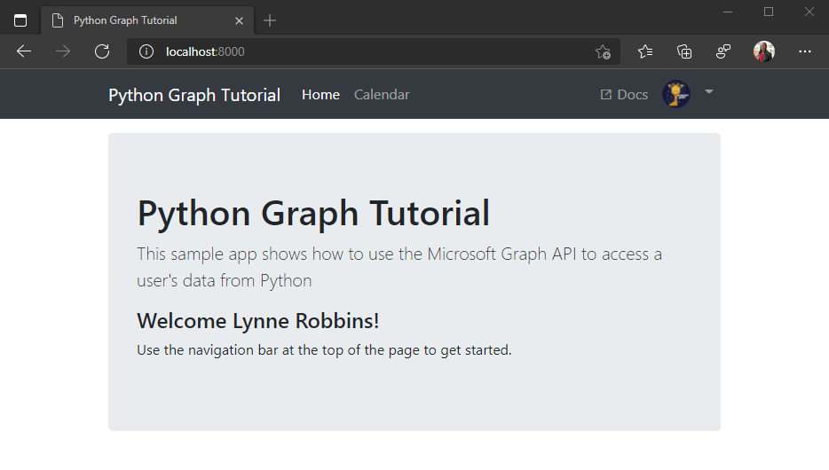

<!-- markdownlint-disable MD002 MD041 -->

In this exercise you will extend the application from the previous exercise to support authentication with Azure AD. This is required to obtain the necessary OAuth access token to call the Microsoft Graph. In this step you will integrate the [MSAL for Python](https://github.com/AzureAD/microsoft-authentication-library-for-python) library into the application.

1. Create a new file in the root of the project named `oauth_settings.yml`, and add the following content.

    :::code language="ini" source="../demo/graph_tutorial/oauth_settings.yml.example":::

## Implement sign-in

1. Create a new file in the **./tutorial** directory named `auth_helper.py` and add the following code.

    :::code language="python" source="../demo/graph_tutorial/tutorial/auth_helper.py" id="FirstCodeSnippet":::

    This file will hold all of your authentication-related methods. The `get_sign_in_flow` generates an authorization URL, and the `get_token_from_code` method exchanges the authorization response for an access token.

1. Add the following `import` statements to the top of **./tutorial/views.py**.

    ```python
    from dateutil import tz, parser
    from tutorial.auth_helper import get_url
    ```

1. Add a sign-in view in the **./tutorial/views.py** file.

    :::code language="python" source="../demo/graph_tutorial/tutorial/views.py" id="SignInViewSnippet":::

    Consider what the view do:

    - The `signin` action redirects the browser to the SSO signin page.

1. Open **./tutorial/urls.py** and replace the existing `path` statements for `signin` with the following.

    ```python
    path('signin', views.sign_in, name='signin'),
    ```

1. Start the server and navigate to `http://localhost:9772`. Click the sign-in button and you should be redirected to `http://localhost:9772/datawiza/sso/login`. Input `python.demo` and click `Continue`. Then you should be redirected to `https://login.microsoftonline.com`. Login with your Microsoft account and consent to the requested permissions. The browser redirects to the app, showing the response, including the access token.

### Get user details

1. Create a new file in the **./tutorial** directory named `graph_helper.py` and add the following code.

    :::code language="python" source="../demo/graph_tutorial/tutorial/graph_helper.py" id="FirstCodeSnippet":::

    The `get_user_mailbox_settings` method makes a GET request to the Microsoft Graph `/me` endpoint to get the user's mailbox settings, using the access token you acquired previously.

1. Add the following new methods to **./tutorial/auth_helper.py**.

    :::code language="python" source="../demo/graph_tutorial/tutorial/auth_helper.py" id="SecondCodeSnippet":::

1. Replace the `from tutorial.auth_helper import get_url` line with the following.

    ```python
    from tutorial.auth_helper import get_url, get_user, get_token
    ```

1. Replace the `initialize_context` method with the following code.

    ```python
    def initialize_context(request):
      context = {}

      # Check for user in the session
      context['user'] = get_user(request)
      return context
    ```

## Implement sign-out

1. Add a new `sign_out` view in **./tutorial/views.py**.

    :::code language="python" source="../demo/graph_tutorial/tutorial/views.py" id="SignOutViewSnippet":::

1. Open **./tutorial/urls.py** and replace the existing `path` statements for `signout` with the following.

    ```python
    path('signout', views.sign_out, name='signout'),
    ```

1. Restart the server and go through the sign-in process. You should end up back on the home page, but the UI should change to indicate that you are signed-in.

    

1. Click the user avatar in the top right corner to access the **Sign Out** link. Clicking **Sign Out** resets the session and returns you to the home page.

    

## Refreshing tokens

At this point your application has an access token, which is sent in the `Authorization` header of API calls. This is the token that allows the app to access the Microsoft Graph on the user's behalf.

However, this token is short-lived. The token expires an hour after it is issued. This is where the refresh token becomes useful. The refresh token allows the app to request a new access token without requiring the user to sign in again.

Because this sample uses MSAL, you do not have to write any specific code to refresh the token. MSAL's `acquire_token_silent` method handles refreshing the token if needed.
